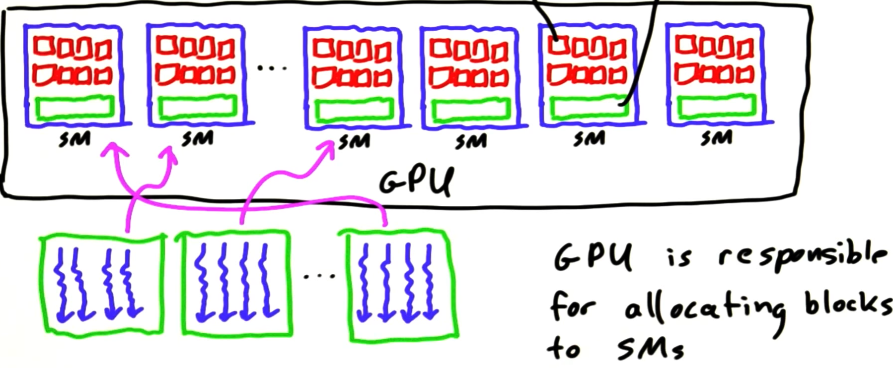
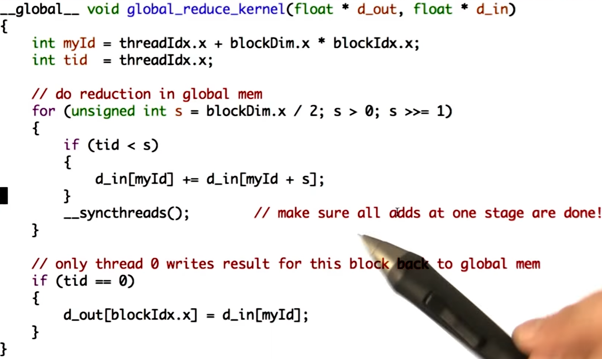

# INTRO TO PARALLEL PROGRAMMING

## Lesson 1 - The GPU Programming Model

### Latency vs Throughput
**CPUs focus on improving latency, whereas GPUs focus on improving throughput:**

### CUDA Program Diagram

### Example: Squaring the Elements of an Array

**Our data might be 2 dimensional, such as an image.**  
**In this case, we might want to arrange our blocks in 2 dimensions instead of 1:**

**We can choose up to 3 dimensional blocks and threads:**

**Each thread/blocks knows its index, as well as the size of the block/grid that it resides in:**

## Lesson 2 - GPU Hardware and Parallel Communication Patterns

### GPU Hardware
**Some GPUs have more SMs than the others.**

**All the SMs run in parallel and independently.**

#### Allocating Blocks to SMs

  * **An SM may run more than one block.**
  * **A block may _not_ run on more than one SM.**

**CUDA guarantees that:**
 - **all threads in a block run on the same SM at the same time.**
 - **all blocks in a kernel finish before any blocks from the next kernel run.**

**CUDA _does not_ guarantee that:**
 - **a block will run at the same time as another block.**
 - **a block will run after another block.**
 - **a block will run on a specific SM.**

| Advantages | Consequences                         |
| :---------:| :-----------------------------------:|
| flexibility| no assumptions on block-SM allocation|
| scalability| no communication between blocks      |

#### GPU Memory Model

**The shared memory is shared among the threads of a block.**

#### Synchronization

**Example: Suppose we want to shift each element of an array to the left.**

**In the code above;**
  - **The first barrier makes sure that the array is initialized correctly.**
  - **The second array makes sure that the value on the right is read correctly by each thread.**
  - **The third barrier makes sure that the array is completely processed before anybody attempts to access it.**

**Global synchronization is achieved by using kernels sequentially.  
In-block synchronization is achieved by using barriers in a block.**

#### Writing Efficient Programs

**Using shared memory:**

#### Atomic Memory Operations

**The second function gives right results, but the first one does not:**

## Lesson 3 - Fundamental GPU Algorithms

### Reduce Algorithm

#### Serial Reduction

#### Parallel Reduction

**Parallel Reduction Using Global Memory:**

**Parallel Reduction Using Shared Memory:**

**Execute Parallel Reduction Kernels:**

### Scan Algorithm

**Scan Using N Reductions:**

**Hillis-Steele Scan:**

**Blelloch Scan:**

**Blelloch Max-Scan Example:**

**Which Algorithm to Choose:**

### Histogram Algorithm

## Lesson 4 - Fundamental GPU Algorithms cont'd

### Compact

#### Multiple Outputs Per Input Element:

### Sparse Matrix Multiplication
#### Segmented Scan:

#### Sparse Matrices:

#### Multiplication:

**Note: Exclusive segmented scan can be replaced with segmented reduce which is more efficient.**

### Sort

## Lesson 5 - Optimizing GPU Programs

### Memory Bandwidth

#### NVVP Tool

### Math Optimizations

### Host-GPU Interactions

#### Pinned Host Memory

#### Streams

**Without Streams:**

**With Streams:**

