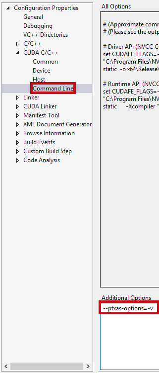

# Learn CUDA
## Contents 
* [My notes](cuda-programming-guide/cuda-programming-guide.md) on the CUDA Programming Guide — http://docs.nvidia.com/cuda/cuda-c-programming-guide/
* [My lecture notes](udacity-cs344/lecture-notes.md) and assingment solutions for the parallel programming course on Udacity — https://classroom.udacity.com/courses/cs344

**How to Display Kernel Resource Usage Details:**

