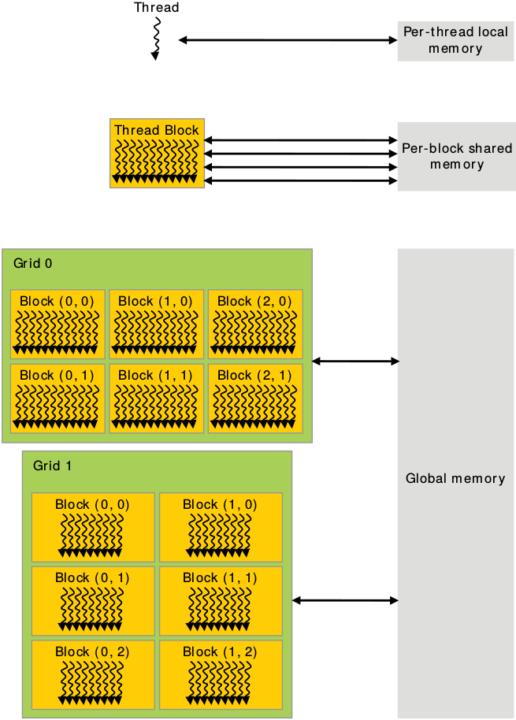
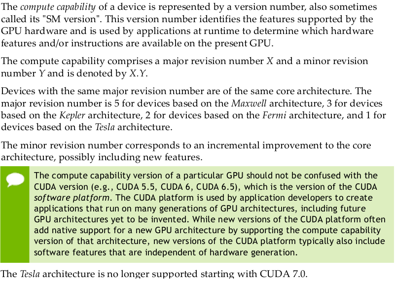
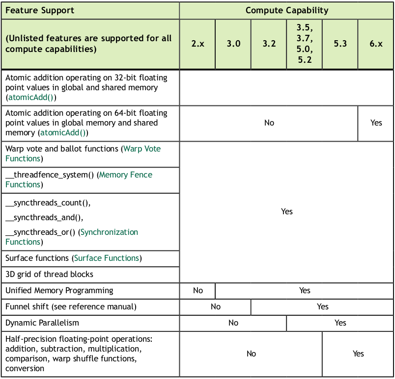
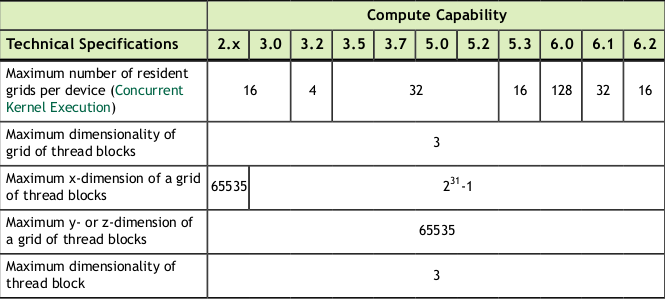
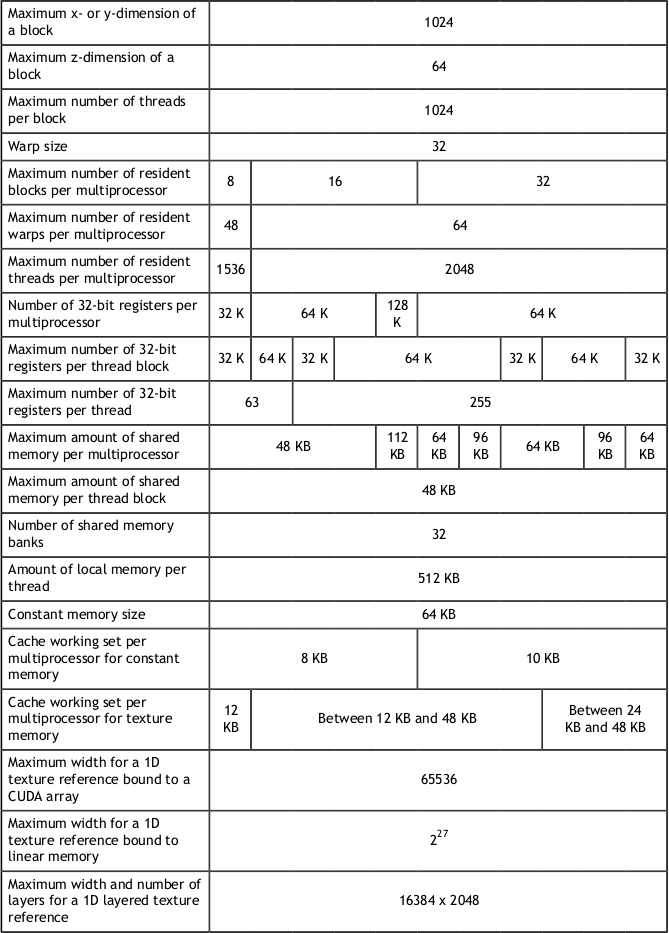
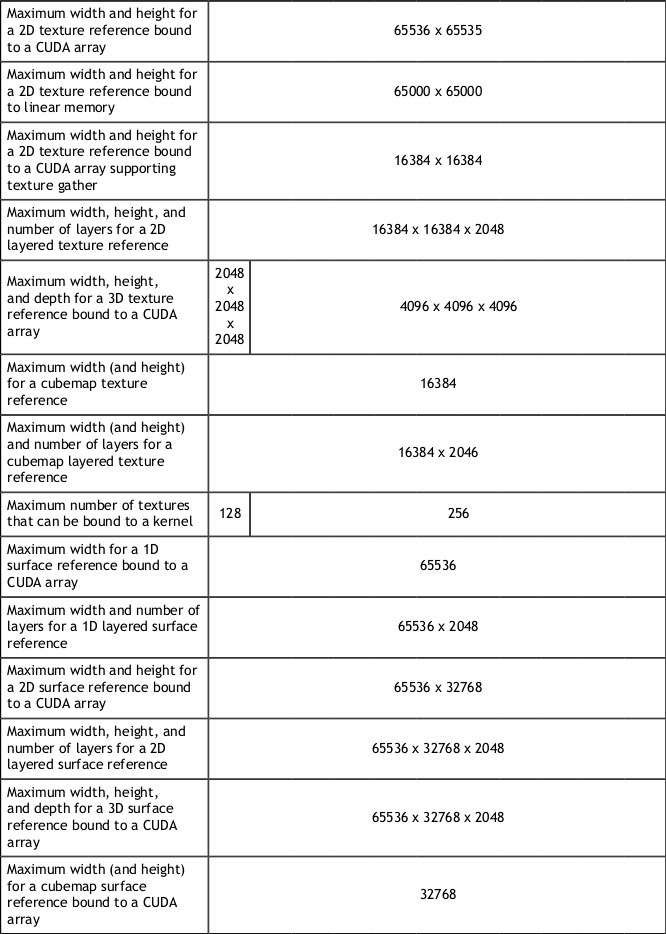
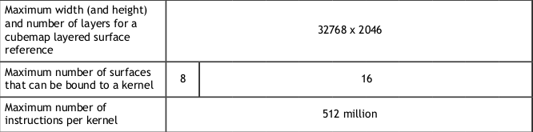
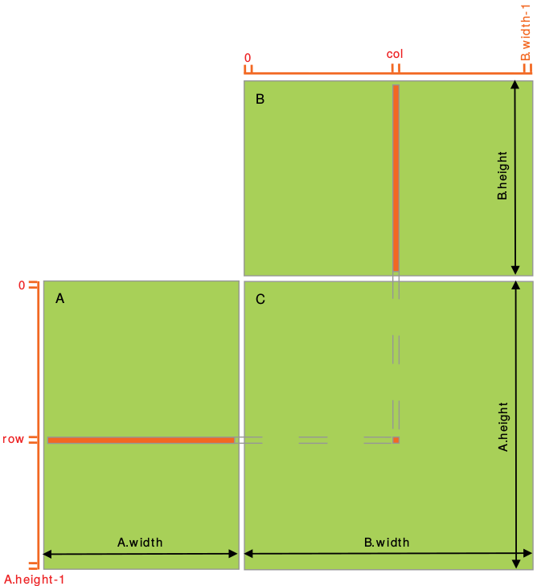
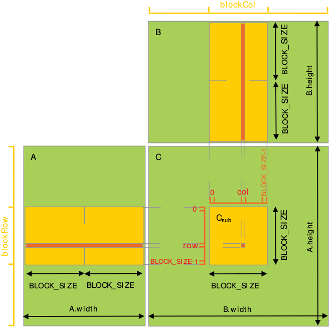
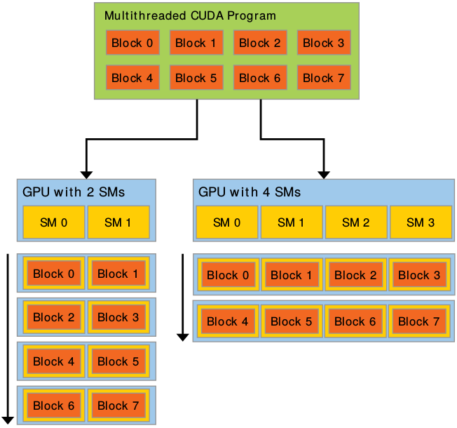

# List of Contents
* [PROGRAMMING MODEL](#programming-model)
  * [Thread Hierarchy](#thread-hierarchy)
  * [Memory Hierarchy](#memory-hierarchy)
  * [Compute Capability](#compute-capability)
* [PROGRAMMING INTERFACE](#programming-interface)
  * [Initialization](#initialization)
  * [Device Memory](#device-memory)
  * [Shared Memory](#shared-memory)
  * [Page-Locked Host Memory](#page-locked-host-memory)
  * [Asynchronous Concurrent Execution](#asynchronous-concurrent-execution)
    * [Concurrent Execution Between Host and Device](#concurrent-execution-between-host-and-device)
    * [Concurrent Kernel Execution](#concurrent-kernel-execution)
    * [Overlap of Data Transfer and Kernel Execution](#overlap-of-data-transfer-and-kernel-execution)
    * [Concurrent Data Transfers](#concurrent-data-transfers)
    * [Streams](#streams)
    * [Events](#events)
    * [Synchronous Calls](#synchronous-calls)
  * [Unified Virtual Address Space](#unified-virtual-address-space)
  * [Error Checking](#error-checking)
* [HARDWARE IMPLEMENTATION](#hardware-implementation)
  * [Streaming Multiprocessors](#streaming-multiprocessors)
  * [Warps](#warps)
* [PERFORMANCE GUIDELINES](#performance-guidelines)
  * [Maximizing Utilization](#maximizing-utilization)
    * [Application Level](#application-level)
    * [Device Level](#device-level)
    * [Multiprocessor Level](#multiprocessor-level)
  * [Maximizing Memory Throughput](#maximizing-memory-throughput)
    * [Data Transfer Between Host and Device](#data-transfer-between-host-and-device)
    * [Device Memory Accesses](#device-memory-accesses)

#  PROGRAMMING MODEL
## Thread Hierarchy
One can specify synchronization points in the kernel by calling the `__syncthreads()` intrinsic function; `__syncthreads()` acts as a barrier at which all threads in the block must wait before any is allowed to proceed.

## Memory Hierarchy
CUDA threads may access data from multiple memory spaces during their execution as illustrated below. Each thread has private local memory. Each thread block has shared memory visible to all threads of the block and with the same lifetime as the block. All threads have access to the same global memory.



## Compute Capability


### Feature Support


### Technical Specifications





# PROGRAMMING INTERFACE
## Initialization
There is no explicit initialization function for the runtime; it initializes the first time a runtime function is called. One needs to keep this in mind when timing runtime function calls and when interpreting the error code from the first call into the runtime.

During initialization, the runtime creates a CUDA [context](#contexts) for each device in the system. This context is the *primary context* for this device and it is shared among all the host threads of the application. As part of this context creation, the device code is just-in-time compiled if necessary and loaded into device memory. This all happens under the hood and the runtime does not expose the primary context to the application.

When a host thread calls `cudaDeviceReset(),` this destroys the primary context of the device the host thread currently operates on. The next runtime function call made by any host thread that has this device as current will create a new primary context for this device.

## Device Memory
Device memory can be allocated either as *linear memory* or as *CUDA arrays*. (CUDA arrays are opaque memory layouts optimized for texture fetching.)

Linear memory is typically allocated using `cudaMalloc()` and freed using `cudaFree()` and data transfer between host memory and device memory are typically done using `cudaMemcpy()`.

Linear memory can also be allocated through `cudaMallocPitch()` and `cudaMalloc3D()`. These functions are recommended for allocations of 2D or 3D arrays as it makes sure that the allocation is appropriately padded to meet the alignment requirements described in [Device Memory Accesses](#device-memory-access), therefore ensuring best performance when accessing the row addresses or performing copies between 2D arrays and other regions of device memory (using the `cudaMemcpy2D()` and `cudaMemcpy3D()` functions).

## Shared Memory
### Matrix Multiplication Without Shared Memory
``` c
// Matrices are stored in row-major order:
// M(row, col) = *(M.elements + row * M.width + col)
typedef struct 
{
    int width;
    int height;
    float* elements;
} Matrix;

// Thread block size
#define BLOCK_SIZE 16

// Forward declaration of the matrix multiplication kernel
__global__ void MatMulKernel(const Matrix, const Matrix, Matrix);

// Matrix multiplication - Host code
// Matrix dimensions are assumed to be multiples of BLOCK_SIZE
void MatMul(const Matrix A, const Matrix B, Matrix C)
{
    // Load A and B to device memory
    Matrix d_A;
    d_A.width = A.width; d_A.height = A.height;
    size_t size = A.width * A.height * sizeof(float);
    cudaMalloc(&d_A.elements, size);
    cudaMemcpy(d_A.elements, A.elements, size,
    cudaMemcpyHostToDevice);

    Matrix d_B;
    d_B.width = B.width; d_B.height = B.height;
    size = B.width * B.height * sizeof(float);
    cudaMalloc(&d_B.elements, size);
    cudaMemcpy(d_B.elements, B.elements, size,
    cudaMemcpyHostToDevice);

    // Allocate C in device memory
    Matrix d_C;
    d_C.width = C.width; d_C.height = C.height;
    size = C.width * C.height * sizeof(float);
    cudaMalloc(&d_C.elements, size);

    // Invoke kernel
    dim3 dimBlock(BLOCK_SIZE, BLOCK_SIZE);
    dim3 dimGrid(B.width / dimBlock.x, A.height / dimBlock.y);
    MatMulKernel<<<dimGrid, dimBlock>>>(d_A, d_B, d_C);

    // Read C from device memory
    cudaMemcpy(C.elements, Cd.elements, size,
    cudaMemcpyDeviceToHost);

    // Free device memory
    cudaFree(d_A.elements);
    cudaFree(d_B.elements);
    cudaFree(d_C.elements);
}

// Matrix multiplication kernel called by MatMul()
__global__ void MatMulKernel(Matrix A, Matrix B, Matrix C)
{
    // Each thread computes one element of C by accumulating results into Cvalue
    float Cvalue = 0;
    int row = blockIdx.y * blockDim.y + threadIdx.y;
    int col = blockIdx.x * blockDim.x + threadIdx.x;

    for (int e = 0; e < A.width; ++e)
    {
        Cvalue += A.elements[row * A.width + e] * B.elements[e * B.width + col];
    }
    C.elements[row * C.width + col] = Cvalue;
}
```


### Matrix Multiplication With Shared Memory
``` c
// Matrices are stored in row-major order:
// M(row, col) = *(M.elements + row * M.stride + col)
typedef struct 
{
    int width;
    int height;
    int stride;
    float* elements;
} Matrix;

// Get a matrix element
__device__ float GetElement(const Matrix A, int row, int col)
{
    return A.elements[row * A.stride + col];
}

// Set a matrix element
__device__ void SetElement(Matrix A, int row, int col, float value)
{
    A.elements[row * A.stride + col] = value;
}

// Get the BLOCK_SIZExBLOCK_SIZE sub-matrix Asub of A that is
// located col sub-matrices to the right and row sub-matrices down
// from the upper-left corner of A
__device__ Matrix GetSubMatrix(Matrix A, int row, int col)
{
    Matrix Asub;
    Asub.width = BLOCK_SIZE;
    Asub.height = BLOCK_SIZE;
    Asub.stride = A.stride;
    Asub.elements = &A.elements[A.stride * BLOCK_SIZE * row + BLOCK_SIZE * col];
    return Asub;
}

// Thread block size
#define BLOCK_SIZE 16

// Forward declaration of the matrix multiplication kernel
__global__ void MatMulKernel(const Matrix, const Matrix, Matrix);

// Matrix multiplication - Host code
// Matrix dimensions are assumed to be multiples of BLOCK_SIZE
void MatMul(const Matrix A, const Matrix B, Matrix C)
{
    // Load A and B to device memory
    Matrix d_A;
    d_A.width = d_A.stride = A.width; d_A.height = A.height;
    size_t size = A.width * A.height * sizeof(float);
    cudaMalloc(&d_A.elements, size);
    cudaMemcpy(d_A.elements, A.elements, size,
    cudaMemcpyHostToDevice);

    Matrix d_B;
    d_B.width = d_B.stride = B.width; d_B.height = B.height;
    size = B.width * B.height * sizeof(float);
    cudaMalloc(&d_B.elements, size);
    cudaMemcpy(d_B.elements, B.elements, size,
    cudaMemcpyHostToDevice);

    // Allocate C in device memory
    Matrix d_C;
    d_C.width = d_C.stride = C.width; d_C.height = C.height;
    size = C.width * C.height * sizeof(float);
    cudaMalloc(&d_C.elements, size);

    // Invoke kernel
    dim3 dimBlock(BLOCK_SIZE, BLOCK_SIZE);
    dim3 dimGrid(B.width / dimBlock.x, A.height / dimBlock.y);
    MatMulKernel<<<dimGrid, dimBlock>>>(d_A, d_B, d_C);

    // Read C from device memory
    cudaMemcpy(C.elements, d_C.elements, size,
    cudaMemcpyDeviceToHost);

    // Free device memory
    cudaFree(d_A.elements);
    cudaFree(d_B.elements);
    cudaFree(d_C.elements);
}

// Matrix multiplication kernel called by MatMul()
__global__ void MatMulKernel(Matrix A, Matrix B, Matrix C)
{
    // Block row and column
    int blockRow = blockIdx.y;
    int blockCol = blockIdx.x;

    // Each thread block computes one sub-matrix Csub of C
    Matrix Csub = GetSubMatrix(C, blockRow, blockCol);

    // Each thread computes one element of Csub by accumulating results into Cvalue
    float Cvalue = 0;

    // Thread row and column within Csub
    int row = threadIdx.y;
    int col = threadIdx.x;

    // Loop over all the sub-matrices of A and B that are required to compute Csub
    // Multiply each pair of sub-matrices together and accumulate the results
    for (int m = 0; m < (A.width / BLOCK_SIZE); ++m) 
    {
        // Get sub-matrix Asub of A
        Matrix Asub = GetSubMatrix(A, blockRow, m);

        // Get sub-matrix Bsub of B
        Matrix Bsub = GetSubMatrix(B, m, blockCol);

        // Shared memory used to store Asub and Bsub respectively
        __shared__ float As[BLOCK_SIZE][BLOCK_SIZE];
        __shared__ float Bs[BLOCK_SIZE][BLOCK_SIZE];

        // Load Asub and Bsub from device memory to shared memory
        // Each thread loads one element of each sub-matrix
        As[row][col] = GetElement(Asub, row, col);
        Bs[row][col] = GetElement(Bsub, row, col);

        // Synchronize to make sure the sub-matrices are loaded before starting the computation
        __syncthreads();

        // Multiply Asub and Bsub together
        for (int e = 0; e < BLOCK_SIZE; ++e)
        {
            Cvalue += As[row][e] * Bs[e][col];
        }

        // Synchronize to make sure that the preceding computation is done 
        // before loading two new sub-matrices of A and B in the next iteration
        __syncthreads();
    }

    // Write Csub to device memory. Each thread writes one element.
    SetElement(Csub, row, col, Cvalue);
}
```


## Page-Locked Host Memory
The runtime provides functions to allow the use of page-locked (pinned) host memory — as opposed to regular pageable host memory allocated by `malloc()`:
* `cudaHostAlloc()` and `cudaFreeHost()` allocate and free page-locked host
memory

* `cudaHostRegister()` page-locks a range of memory allocated by `malloc()` (see reference manual for limitations) 

Using page-locked host memory has several benefits:
* Copies between page-locked host memory and device memory can be performed concurrently with kernel execution for some devices as mentioned in [Asynchronous Concurrent Execution](#asynchronous-concurrent-execution).

* On some devices, page-locked host memory can be mapped into the address space of the device, eliminating the need to copy it to or from device memory as detailed in [Mapped Memory](#mapped-memory).

* On systems with a front-side bus, bandwidth between host memory and device memory is higher if host memory is allocated as page-locked and even higher if in addition it is allocated as *write-combining* as described in [Write-Combining Memory](#write-combining-memory).

Page-locked host memory is a scarce resource however, so allocations in page-locked memory will start failing long before allocations in pageable memory. In addition, by reducing the amount of physical memory available to the operating system for paging, consuming too much page-locked memory reduces overall system performance.

### Write-Combining Memory
By default page-locked host memory is allocated as cacheable. It can optionally be allocated as *write-combining* instead by passing flag `cudaHostAllocWriteCombined` to `cudaHostAlloc()`. 

Write-combining memory frees up the host's L1 and L2 cache resources, making more cache available to the rest of the application. In addition, write-combining memory is not snooped during transfers across the PCI Express bus, which can improve transfer performance by up to 40%.

Reading from write-combining memory from the host is prohibitively slow, so write-combining memory should in general be used for memory that the host only write  to.

### Mapped Memory
A block of page-locked host memory can also be mapped into the address space of the device by passing flag `cudaHostAllocMapped` to `cudaHostAlloc()` or by passing flag `cudaHostRegisterMapped` to `cudaHostRegister()`. Such a block has therefore in general two addresses: one in host memory that is returned by `cudaHostAlloc()` or `malloc()`, and one in device memory that can be retrieved using `cudaHostGetDevicePointer()` and then used to access the block from within a kernel. The only exception is for pointers allocated with `cudaHostAlloc()` and when a [unified virtual address space](#unified-virtual-address-space) is used for the host and the device.

Accessing host memory directly from within a kernel has several advantages:

* There is no need to allocate a block in device memory and copy data between this block and the block in host memory; data transfers are implicitly performed as needed by the kernel;

* There is no need to use [streams](#streams) to overlap data transfers with kernel execution; the kernel-originated data transfers automatically overlap with kernel execution.

Since mapped page-locked memory is shared between host and device however, the application must synchronize memory accesses using streams or events (see [Asynchronous Concurrent Execution](#asynchronous-concurrent-execution)) to avoid any potential *read-after-write*, *write-after-read*, or *write-after-write* hazards.

To be able to retrieve the device pointer to any mapped page-locked memory, page-locked memory mapping must be enabled by calling `cudaSetDeviceFlags()` with the `cudaDeviceMapHost` flag before any other CUDA call is performed. Otherwise, `cudaHostGetDevicePointer()` will return an error. 

`cudaHostGetDevicePointer()` also returns an error if the device does not support mapped page-locked host memory. Applications may query this capability by checking the `canMapHostMemory` device property, which is equal to 1 for devices that support mapped page-locked host memory. 

Note that [atomic functions](#atomic-functions) operating on mapped page-locked memory are not atomic from the point of view of the host or other devices.

## Asynchronous Concurrent Execution
CUDA exposes the following operations as independent tasks that can operate
concurrently with one another:
- Computation on the host;
- Computation on the device;
- Memory transfers from the host to the device;
- Memory transfers from the device to the host;
- Memory transfers within the memory of a given device;
- Memory transfers among devices.

### Concurrent Execution between Host and Device
Concurrent host execution is facilitated through asynchronous library functions that return control to the host thread before the device completes the requested task. Using asynchronous calls, many device operations can be queued up together to be executed by the CUDA driver when appropriate device resources are available. This relieves the host thread of much of the responsibility to manage the device, leaving it free for other tasks. The following device operations are asynchronous with respect to the host:
- Kernel launches;
- Memory copies within a single device's memory;
- Memory copies from host to device of a memory block of 64 KB or less;
- Memory copies performed by functions that are suffixed with `Async`;
- Memory set function calls.

*`Async` memory copies will be synchronous if they involve host memory that is not page-locked.*

### Concurrent Kernel Execution
Some devices can execute multiple kernels concurrently. Applications may query this capability by checking the `concurrentKernels` device property, which is equal to 1 for devices that support it.

The maximum number of kernel launches that a device can execute concurrently depends on its compute capability.

A kernel from one CUDA context cannot execute concurrently with a kernel from another CUDA context.

Kernels that use many textures or a large amount of local memory are less likely to execute concurrently with other kernels.

### Overlap of Data Transfer and Kernel Execution
Some devices can perform an asynchronous memory copy to or from the GPU concurrently with kernel execution. Applications may query this capability by checking the `asyncEngineCount` device property, which is greater than zero for devices that support it. If host memory is involved in the copy, it must be page-locked.

It is also possible to perform an intra-device copy simultaneously with kernel execution and/or with copies to or from the device. Intra-device copies are initiated using the standard memory copy functions with destination and source addresses residing on the same device. 

### Concurrent Data Transfers
Some devices can overlap copies to and from the device. Applications may query this capability by checking the `asyncEngineCount` device property, which is equal to 2 for devices that support it. In order to be overlapped, any host memory involved in the transfers must be page-locked.

### Streams
Applications manage the concurrent operations described above through streams. A stream is a sequence of commands (possibly issued by different host threads) that execute in order. Different streams, on the other hand, may execute their commands out of order with respect to one another or concurrently; this behavior is not guaranteed and should therefore not be relied upon for correctness.

#### Stream Creation and Destruction
A stream is defined by creating a stream object and specifying it as the stream parameter to a sequence of kernel launches and host <-> device memory copies. The following code sample creates two streams and allocates an array `hostPtr` of `float` in page-locked memory:
``` c
cudaStream_t stream[2];
for (int i = 0; i < 2; ++i)
    cudaStreamCreate(&stream[i]);
float* hostPtr;
cudaMallocHost(&hostPtr, 2 * size);
```
Each of these streams is defined by the following code sample as a sequence of one memory copy from host to device, one kernel launch, and one memory copy from device to host:
``` c
for (int i = 0; i < 2; ++i) 
{
    cudaMemcpyAsync(inputDevPtr + i * size, hostPtr + i * size, size, cudaMemcpyHostToDevice, stream[i]);
    MyKernel <<<100, 512, 0, stream[i]>>>(outputDevPtr + i * size, inputDevPtr + i * size, size);
    cudaMemcpyAsync(hostPtr + i * size, outputDevPtr + i * size, size, cudaMemcpyDeviceToHost, stream[i]);
}
```

Each stream copies its portion of input array `hostPtr` to array `inputDevPtr` in device memory, processes `inputDevPtr` on the device by calling `MyKernel()`, and copies the result `outputDevPtr` back to the same portion of `hostPtr`. Note that `hostPtr` must point to page-locked host memory for any overlap to occur.

Streams are released by calling `cudaStreamDestroy()`, which waits for all preceding commands in the given stream to complete before destroying the stream and returning control to the host thread:
``` c
for (int i = 0; i < 2; ++i)
    cudaStreamDestroy(stream[i]);
```

#### Default Stream
Kernel launches and host <-> device memory copies that do not specify any stream parameter, or equivalently that set the stream parameter to zero, are issued to the default stream. They are therefore executed in order.

For code that is compiled using the `--default-stream per-thread` compilation flag (or that defines the `CUDA_API_PER_THREAD_DEFAULT_STREAM` macro before including CUDA headers (`cuda.h` and `cuda_runtime.h`)), the default stream is a regular stream and each host thread has its own default stream.

For code that is compiled using the `--default-stream` legacy compilation flag, the default stream is a special stream called the `NULL` stream and each device has a single `NULL` stream used for all host threads. The `NULL` stream is special as it causes implicit synchronization as described in [Implicit Synchronization](#implicit-synchronization).

For code that is compiled without specifying a `--default-stream` compilation flag, `--default-stream` legacy is assumed as the default.

#### Explicit Synchronization
There are various ways to explicitly synchronize streams with each other.

**`cudaDeviceSynchronize()`** waits until all preceding commands in all streams of all host threads have completed.

**`cudaStreamSynchronize()`** takes a stream as a parameter and waits until all preceding commands in the given stream have completed. It can be used to synchronize the host with a specific stream, allowing other streams to continue executing on the device.

**`cudaStreamWaitEvent()`** takes a stream and an [event](#events) as parameters and makes all the commands added to the given stream after the call to `cudaStreamWaitEvent()` delay their execution until the given event has completed. The stream can be 0, in which case all the commands added to any stream after the call to `cudaStreamWaitEvent()` wait on the event.

**`cudaStreamQuery()`** provides applications with a way to know if all preceding commands in a stream have completed.

*To avoid unnecessary slowdowns, all these synchronization functions are usually best used for timing purposes or to isolate a launch or memory copy that is failing.*

#### Implicit Synchronization
Two commands from different streams cannot run concurrently if any one of the following operations is issued in-between them by the host thread:
* a page-locked host memory allocation,
* a device memory allocation,
* a device memory set,
* a memory copy between two addresses to the same device memory,
* any CUDA command to the NULL stream.

#### Overlapping Behavior
The amount of execution overlap between two streams depends on the order in which the commands are issued to each stream and whether or not the device supports [overlap of data transfer and kernel execution](#overlap-of-data-transfer-and-kernel-execution), [concurrent kernel execution](#concurrent-kernel-execution), and/or [concurrent data transfers](#concurrent-data-transfers).

On devices that support [concurrent data transfers](#concurrent-data-transfers), the two streams of the code sample of [Stream Creation and Destruction](#stream-creation-and-destruction) do overlap: The memory copy from host to device issued to `stream[1]` overlaps with the memory copy from device to host issued to `stream[0]` and even with the kernel launch issued to `stream[0]` (assuming the device supports [overlap of data transfer and kernel execution](#overlap-of-data-transfer-and-kernel-execution)).

#### Callbacks
The runtime provides a way to insert a callback at any point into a stream via `cudaStreamAddCallback().`  A callback is a function that is executed on the host once all commands issued to the stream before the callback have completed. Callbacks in stream 0 are executed once all preceding tasks and commands issued in all streams before the callback have completed.

The following code sample adds the callback function MyCallback to each of two streams after issuing a host-to-device memory copy, a kernel launch and a device-to-host memory copy into each stream. The callback will begin execution on the host after each of the device-to-host memory copies completes.
``` c
void CUDART_CB MyCallback(cudaStream_t stream, cudaError_t status, void *data)
{
    printf("Inside callback %d\n", (size_t) data);
}

...

for (size_t i = 0; i < 2; ++i) 
{
    cudaMemcpyAsync(devPtrIn[i], hostPtr[i], size, cudaMemcpyHostToDevice, stream[i]);
    MyKernel<<<100, 512, 0, stream[i]>>>(devPtrOut[i], devPtrIn[i], size);
    cudaMemcpyAsync(hostPtr[i], devPtrOut[i], size, cudaMemcpyDeviceToHost, stream[i]);
    cudaStreamAddCallback(stream[i], MyCallback, (void*) i, 0);
}
```

The commands that are issued in a stream after a callback do not start executing before the callback has completed. The last parameter of `cudaStreamAddCallback()` is reserved for future use.

*A callback must not make CUDA API calls (directly or indirectly), as it might end up waiting on itself if it makes such a call leading to a deadlock.*

#### Stream Priorities
The relative priorities of streams can be specified at creation using `cudaStreamCreateWithPriority().` The range of allowable priorities can be obtained using the `cudaDeviceGetStreamPriorityRange()` function. At runtime, as blocks in low-priority schemes finish, waiting blocks in higher-priority streams are scheduled in their place.

The following code sample obtains the allowable range of priorities for the current device, and creates streams with the highest and lowest available priorities:
``` c
// get the range of stream priorities for this device
int priority_high, priority_low;
cudaDeviceGetStreamPriorityRange(&priority_low, &priority_high);

// create streams with highest and lowest available priorities
cudaStream_t st_high, st_low;
cudaStreamCreateWithPriority(&st_high, cudaStreamNonBlocking, priority_high);
cudaStreamCreateWithPriority(&st_low, cudaStreamNonBlocking, priority_low);
```

### Events
The runtime provides a way to closely monitor the device's progress, as well as perform accurate timing, by letting the application asynchronously record events at any point in the program and query when these events are completed. An event has completed when all tasks - or optionally, all commands in a given stream - preceding the event have completed. Events in stream 0 are completed after all preceding tasks and commands in all streams are completed.

#### Event Creation and Destruction
``` c
// create two events
cudaEvent_t start, stop;
cudaEventCreate(&start);
cudaEventCreate(&stop)

// destroy the events
cudaEventDestroy(start);
cudaEventDestroy(stop);
```
#### Elapsed Time
The events created above can be used to time the code sample of [Stream Creation and Destruction](#stream-creation-and-destruction) the following way:
``` c
cudaEventRecord(start, 0);

for (int i = 0; i < 2; ++i) 
{
    cudaMemcpyAsync(inputDev + i * size, inputHost + i * size, size, cudaMemcpyHostToDevice, stream[i]);
    MyKernel<<<100, 512, 0, stream[i]>>>(outputDev + i * size, inputDev + i * size, size);
    cudaMemcpyAsync(outputHost + i * size, outputDev + i * size, size, cudaMemcpyDeviceToHost, stream[i]);
}
cudaEventRecord(stop, 0);
cudaEventSynchronize(stop);
float elapsedTime;
cudaEventElapsedTime(&elapsedTime, start, stop);
```

### Synchronous Calls
When a synchronous function is called, control is not returned to the host thread before the device has completed the requested task. Whether the host thread will then yield, block, or spin can be specified by calling `cudaSetDeviceFlags()` with some specific flags before any other CUDA call is performed by the host thread.

## Unified Virtual Address Space
When the application is run as a 64-bit process, a single address space is used for the host and all the devices. All host memory allocations made via CUDA API calls and all device memory allocations on supported devices are within this virtual address range. As a consequence:

 * The location of any memory on the host allocated through CUDA, or on any of the devices which use the unified address space, can be determined from the value of the pointer using `cudaPointerGetAttributes().`

 * When copying to or from the memory of any device which uses the unified address space, the `cudaMemcpyKind` parameter of `cudaMemcpy*()` can be set to `cudaMemcpyDefault` to determine locations from the pointers. This also works for host pointers not allocated through CUDA, as long as the current device uses unified addressing.

Applications may query if the unified address space is used for a particular device by checking that the `unifiedAddressing` device property is equal to 1.

## Error Checking
All runtime functions return an error code, but for an [asynchronous function](#asynchronous-concurrent-execution), this error code cannot possibly report any of the asynchronous errors that could occur on the device since the function returns before the device has completed the task; the error code only reports errors that occur on the host prior to executing the task, typically related to parameter validation; if an asynchronous error occurs, it will be reported by some subsequent unrelated runtime function call.

The only way to check for asynchronous errors just after some asynchronous function call is therefore to synchronize just after the call by calling `cudaDeviceSynchronize()` (or by using any other [synchronization mechanisms](#asynchronous-concurrent-execution)) and checking the error code returned by `cudaDeviceSynchronize().`

The runtime maintains an error variable for each host thread that is initialized to `cudaSuccess` and is overwritten by the error code every time an error occurs (be it a parameter validation error or an asynchronous error). `cudaPeekAtLastError()` returns this variable. `cudaGetLastError()` returns this variable and resets it to `cudaSuccess.`

Kernel launches do not return any error code, so `cudaPeekAtLastError()` or `cudaGetLastError()` must be called just after the kernel launch to retrieve any pre-launch errors. To ensure that any error returned by `cudaPeekAtLastError()` or `cudaGetLastError()` does not originate from calls prior to the kernel launch, one has to make sure that the runtime error variable is set to `cudaSuccess` just before the kernel launch, for example, by calling `cudaGetLastError()` just before the kernel launch. Kernel launches are asynchronous, so to check for asynchronous errors, the application must synchronize in-between the kernel launch and the call to `cudaPeekAtLastError()` or `cudaGetLastError().`

Note that `cudaErrorNotReady` that may be returned by `cudaStreamQuery()` and `cudaEventQuery()` is not considered an error and is therefore not reported by `cudaPeekAtLastError()` or `cudaGetLastError().`

# HARDWARE IMPLEMENTATION
## Streaming Multiprocessors
The NVIDIA GPU architecture is built around a scalable array of multithreaded *Streaming Multiprocessors* (SMs). When a CUDA program on the host CPU invokes a kernel grid, the blocks of the grid are enumerated and distributed to multiprocessors with available execution capacity. The threads of a thread block execute concurrently on one multiprocessor, and multiple thread blocks can execute concurrently on one multiprocessor. As thread blocks terminate, new blocks are launched on the vacated multiprocessors.



## Warps
The multiprocessor creates, manages, schedules, and executes threads in groups of 32 parallel threads called warps. Individual threads composing a warp start together at the same program address, but they have their own instruction address counter and register state and are therefore free to branch and execute independently.

When a multiprocessor is given one or more thread blocks to execute, it partitions them into warps and each warp gets scheduled by a warp scheduler for execution. The way a block is partitioned into warps is always the same; each warp contains threads of consecutive, increasing thread IDs with the first warp containing thread 0.

A warp executes one common instruction at a time, so full efficiency is realized when all 32 threads of a warp agree on their execution path. If threads of a warp diverge via a data-dependent conditional branch, the warp serially executes each branch path taken, disabling threads that are not on that path, and when all paths complete, the threads converge back to the same execution path. Branch divergence occurs only within a warp; different warps execute independently regardless of whether they are executing common or disjoint code paths.

*Substantial performance improvements can be realized by taking care that the code seldom requires threads in a warp to diverge.*

The threads of a warp that are on that warp's current execution path are called the *active threads*, whereas threads not on the current path are *inactive* (disabled). Threads can be inactive because they have exited earlier than other threads of their warp, or because they are on a different branch path than the branch path currently executed by the warp, or because they are the last threads of a block whose number of threads is not a multiple of the warp size.

The number of blocks and warps that can reside and be processed together on the multiprocessor for a given kernel depends on the amount of registers and shared memory used by the kernel and the amount of registers and shared memory available on the multiprocessor. There are also a maximum number of resident blocks and a maximum number of resident warps per multiprocessor. These limits as well the amount of registers and shared memory available on the multiprocessor are a function of the [compute capability](#compute-capability) of the device . If there are not enough registers or shared memory available per multiprocessor to process at least one block, the kernel will fail to launch.

# PERFORMANCE GUIDELINES
## Maximizing Utilization
### Application Level
At a high level, the application should maximize parallel execution between the host, the devices, and the bus connecting the host to the devices, by using asynchronous functions calls and streams as described in [Asynchronous Concurrent Execution](#asynchoronous-concurrent-execution). It should assign to each processor the type of work it does best: serial workloads to the host; parallel workloads to the devices.

For the parallel workloads, at points in the algorithm where parallelism is broken because some threads need to synchronize in order to share data with each other, there are two cases: Either these threads belong to the same block, in which case they should use `__syncthreads()` and share data through shared memory within the same kernel invocation, or they belong to different blocks, in which case they must share data through global memory using two separate kernel invocations, one for writing to and one for reading from global memory. The second case is much less optimal since it adds the overhead of extra kernel invocations and global memory traffic. Its occurrence should therefore be minimized by mapping the algorithm to the CUDA programming model in such a way that the computations that require inter-thread communication are performed within a single thread block as much as possible.

### Device Level
Multiple kernels can execute concurrently on a device, so maximum utilization can also be achieved by using streams to enable enough kernels to execute concurrently as described in [Asynchronous Concurrent Execution](#asynchoronous-concurrent-execution).

### Multiprocessor Level
Utilization is directly linked to the number of resident warps.

The number of blocks and warps residing on each multiprocessor for a given kernel call depends on the [execution configuration](#execution-configuration) of the call, the memory resources of the multiprocessor, and the resource requirements of the kernel.

The total amount of shared memory required for a block is equal to the sum of the amount of statically allocated shared memory and the amount of dynamically allocated shared memory.

The number of registers used by a kernel can have a significant impact on the number of resident warps. For example, for devices of compute capability 2.x, if a kernel uses 32 registers and each block has 512 threads and requires very little shared memory, then two blocks (i.e., 32 warps) can reside on the multiprocessor since they require 2x512x32 registers, which exactly matches the number of registers available on the multiprocessor. But as soon as the kernel uses one more register, only one block (i.e., 16 warps) can be resident since two blocks would require 2x512x17 registers, which are more registers than are available on the multiprocessor. Therefore, the compiler attempts to minimize register usage while keeping register spilling (see [Device Memory Accesses](#device-memory-accesses)) and the number of instructions to a minimum. Register usage can be controlled using the **`maxrregcount`** compiler option or launch bounds as described in [Launch Bounds](#launch-bounds).

Each **`double`** variable and each long long variable uses two registers.

The effect of execution configuration on performance for a given kernel call generally depends on the kernel code. Experimentation is therefore recommended. Applications can also parameterize execution configurations based on register file size and shared memory size, which depends on the compute capability of the device, as well as on the number of multiprocessors and memory bandwidth of the device, all of which can be queried using the runtime.

The number of threads per block should be chosen as a multiple of the warp size to avoid wasting computing resources with under-populated warps as much as possible.

## Maximizing Memory Throughput
The first step in maximizing overall memory throughput for the application is to minimize data transfers with low bandwidth.

That means minimizing data transfers between the host and the device, since these have much lower bandwidth than data transfers between global memory and the device.

That also means minimizing data transfers between global memory and the device by maximizing use of on-chip memory: shared memory and caches.

The throughput of memory accesses by a kernel can vary by an order of magnitude depending on access pattern for each type of memory. The next step in maximizing memory throughput is therefore to organize memory accesses as optimally as possible based on the optimal memory access patterns described in [Device Memory Accesses](#device-memory-accesses). This optimization is especially important for global memory accesses as global memory bandwidth is low, so non-optimal global memory accesses have a higher impact on performance.

### Data Transfer Between Host and Device
Applications should strive to minimize data transfer between the host and the device. One way to accomplish this is to move more code from the host to the device, even if that means running kernels with low parallelism computations. Intermediate data structures may be created in device memory, operated on by the device, and destroyed without ever being mapped by the host or copied to host memory.

Also, because of the overhead associated with each transfer, batching many small transfers into a single large transfer always performs better than making each transfer separately.

On systems with a front-side bus, higher performance for data transfers between host and device is achieved by using page-locked host memory as described in Page-Locked Host Memory.

In addition, when using mapped page-locked memory ([Mapped Memory](#mapped-memory)), there is no need to allocate any device memory and explicitly copy data between device and host memory. Data transfers are implicitly performed each time the kernel accesses the mapped memory. For maximum performance, these memory accesses must be coalesced as with accesses to global memory. Assuming that they are and that the mapped memory is read or written only once, using mapped page-locked memory instead of explicit copies between device and host memory can be a win for performance.

## Maximizing Instruction Throughput
### Arithmetic Instructions
In general, code compiled with **`-ftz=true`** (denormalized numbers are flushed to zero) tends to have higher performance than code compiled with **`-ftz=false`**. Similarly, code compiled with **`-prec div=false`** (less precise division) tends to have higher performance code than code compiled with **`-prec div=true`** , and code compiled with **`-prec-sqrt=false`** (less precise square root) tends to have higher performance than code compiled with **`-prec-sqrt=true`**.


<br>
<br>
<br>
<br>
<br>
<br>
<br>
<br>
<br>
<br>
<br>
<br>
<br>
<br>
<br>
<br>
