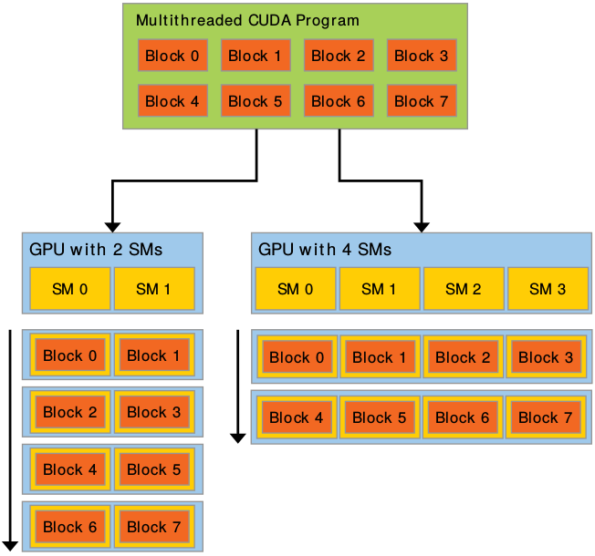
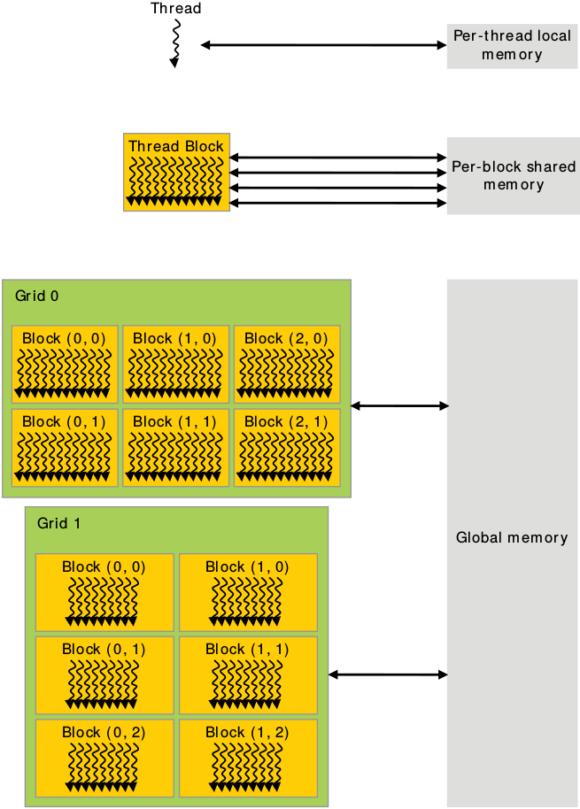
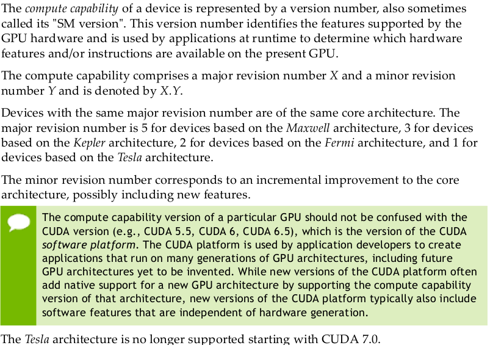
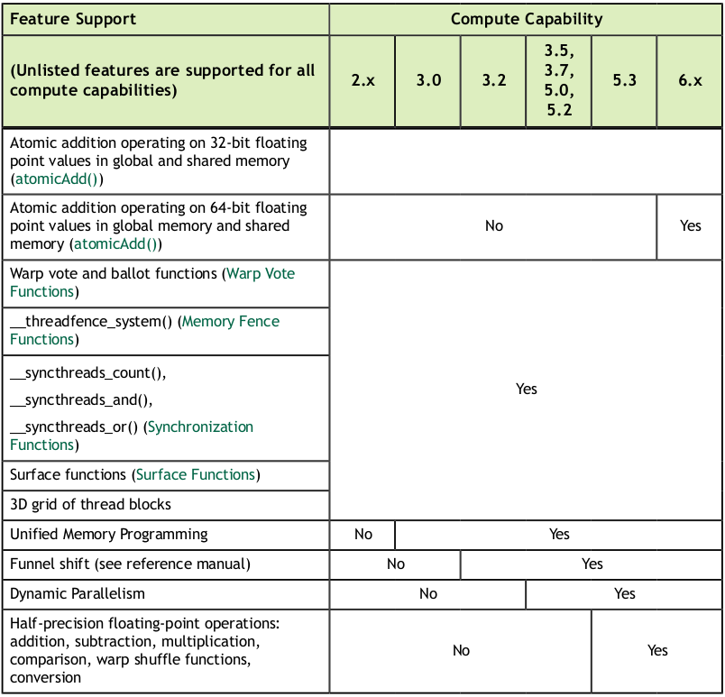
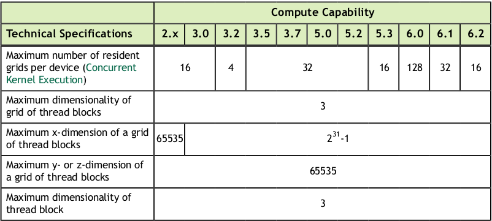
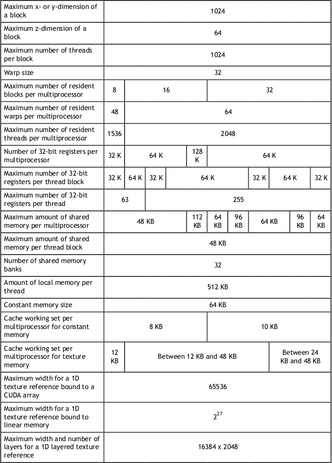
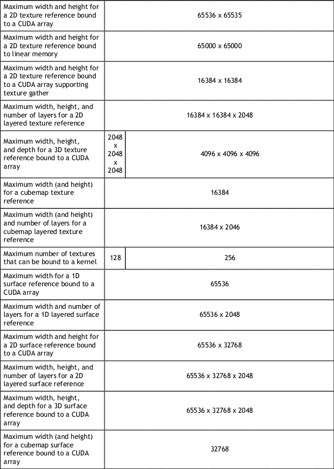
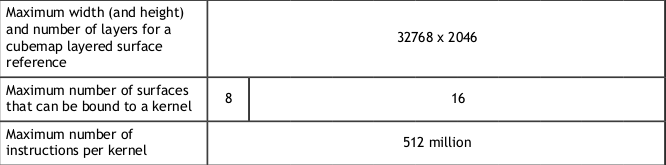

# CUDA PROGRAMMING GUIDE
## 1. INTRODUCTION
### 1.1. Streaming Multiprocessors
A GPU is built around an array of Streaming Multiprocessors (SMs). A multithreaded program is partitioned into blocks of threads that execute independently from each other, so that a GPU with more multiprocessors will automatically execute the program in less time than a GPU with fewer multiprocessors.

## 2. PROGRAMMING MODEL
### 2.1. Thread Hierarchy
One can specify synchronization points in the kernel by calling the `__syncthreads()` intrinsic function; `__syncthreads()` acts as a barrier at which all threads in the block must wait before any is allowed to proceed.

### 2.2. Memory Hierarchy
CUDA threads may access data from multiple memory spaces during their execution as illustrated below. Each thread has private local memory. Each thread block has shared memory visible to all threads of the block and with the same lifetime as the block. All threads have access to the same global memory.

### 2.3. Compute Capability

#### Feature Support

#### Technical Specifications

