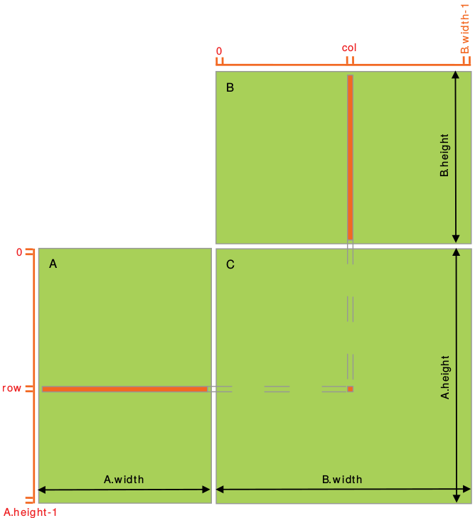
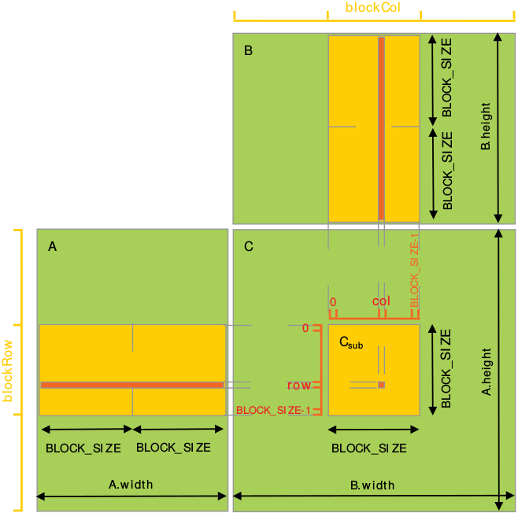

# 1. INTRODUCTION
## Streaming Multiprocessors
A GPU is built around an array of Streaming Multiprocessors (SMs). A multithreaded program is partitioned into blocks of threads that execute independently from each other, so that a GPU with more multiprocessors will automatically execute the program in less time than a GPU with fewer multiprocessors.


# 2. PROGRAMMING MODEL
## Thread Hierarchy
One can specify synchronization points in the kernel by calling the `__syncthreads()` intrinsic function; `__syncthreads()` acts as a barrier at which all threads in the block must wait before any is allowed to proceed.

## Memory Hierarchy
CUDA threads may access data from multiple memory spaces during their execution as illustrated below. Each thread has private local memory. Each thread block has shared memory visible to all threads of the block and with the same lifetime as the block. All threads have access to the same global memory.


## Compute Capability


### Feature Support


### Technical Specifications


# 3. PROGRAMMING INTERFACE
## Initialization
There is no explicit initialization function for the runtime; it initializes the first time a runtime function is called. One needs to keep this in mind when timing runtime function calls and when interpreting the error code from the first call into the runtime.

During initialization, the runtime creates a CUDA [context](#contexts) for each device in the system. This context is the *primary context* for this device and it is shared among all the host threads of the application. As part of this context creation, the device code is just-in-time compiled if necessary and loaded into device memory. This all happens under the hood and the runtime does not expose the primary context to the application.

When a host thread calls `cudaDeviceReset(),` this destroys the primary context of the device the host thread currently operates on. The next runtime function call made by any host thread that has this device as current will create a new primary context for this device.

## Device Memory
Device memory can be allocated either as *linear memory* or as *CUDA arrays*. (CUDA arrays are opaque memory layouts optimized for texture fetching.)

Linear memory is typically allocated using `cudaMalloc()` and freed using `cudaFree()` and data transfer between host memory and device memory are typically done using `cudaMemcpy()`.

Linear memory can also be allocated through `cudaMallocPitch()` and `cudaMalloc3D()`. These functions are recommended for allocations of 2D or 3D arrays as it makes sure that the allocation is appropriately padded to meet the alignment requirements described in [Device Memory Accesses](#device-memory-access), therefore ensuring best performance when accessing the row addresses or performing copies between 2D arrays and other regions of device memory (using the `cudaMemcpy2D()` and `cudaMemcpy3D()` functions).

## Shared Memory
### Matrix Multiplication Without Shared Memory
``` c
// Matrices are stored in row-major order:
// M(row, col) = *(M.elements + row * M.width + col)
typedef struct 
{
    int width;
    int height;
    float* elements;
} Matrix;

// Thread block size
#define BLOCK_SIZE 16

// Forward declaration of the matrix multiplication kernel
__global__ void MatMulKernel(const Matrix, const Matrix, Matrix);

// Matrix multiplication - Host code
// Matrix dimensions are assumed to be multiples of BLOCK_SIZE
void MatMul(const Matrix A, const Matrix B, Matrix C)
{
    // Load A and B to device memory
    Matrix d_A;
    d_A.width = A.width; d_A.height = A.height;
    size_t size = A.width * A.height * sizeof(float);
    cudaMalloc(&d_A.elements, size);
    cudaMemcpy(d_A.elements, A.elements, size,
    cudaMemcpyHostToDevice);

    Matrix d_B;
    d_B.width = B.width; d_B.height = B.height;
    size = B.width * B.height * sizeof(float);
    cudaMalloc(&d_B.elements, size);
    cudaMemcpy(d_B.elements, B.elements, size,
    cudaMemcpyHostToDevice);

    // Allocate C in device memory
    Matrix d_C;
    d_C.width = C.width; d_C.height = C.height;
    size = C.width * C.height * sizeof(float);
    cudaMalloc(&d_C.elements, size);

    // Invoke kernel
    dim3 dimBlock(BLOCK_SIZE, BLOCK_SIZE);
    dim3 dimGrid(B.width / dimBlock.x, A.height / dimBlock.y);
    MatMulKernel<<<dimGrid, dimBlock>>>(d_A, d_B, d_C);

    // Read C from device memory
    cudaMemcpy(C.elements, Cd.elements, size,
    cudaMemcpyDeviceToHost);

    // Free device memory
    cudaFree(d_A.elements);
    cudaFree(d_B.elements);
    cudaFree(d_C.elements);
}

// Matrix multiplication kernel called by MatMul()
__global__ void MatMulKernel(Matrix A, Matrix B, Matrix C)
{
    // Each thread computes one element of C by accumulating results into Cvalue
    float Cvalue = 0;
    int row = blockIdx.y * blockDim.y + threadIdx.y;
    int col = blockIdx.x * blockDim.x + threadIdx.x;

    for (int e = 0; e < A.width; ++e)
    {
        Cvalue += A.elements[row * A.width + e] * B.elements[e * B.width + col];
    }
    C.elements[row * C.width + col] = Cvalue;
}
```


### Matrix Multiplication With Shared Memory
``` c
// Matrices are stored in row-major order:
// M(row, col) = *(M.elements + row * M.stride + col)
typedef struct 
{
    int width;
    int height;
    int stride;
    float* elements;
} Matrix;

// Get a matrix element
__device__ float GetElement(const Matrix A, int row, int col)
{
    return A.elements[row * A.stride + col];
}

// Set a matrix element
__device__ void SetElement(Matrix A, int row, int col, float value)
{
    A.elements[row * A.stride + col] = value;
}

// Get the BLOCK_SIZExBLOCK_SIZE sub-matrix Asub of A that is
// located col sub-matrices to the right and row sub-matrices down
// from the upper-left corner of A
__device__ Matrix GetSubMatrix(Matrix A, int row, int col)
{
    Matrix Asub;
    Asub.width = BLOCK_SIZE;
    Asub.height = BLOCK_SIZE;
    Asub.stride = A.stride;
    Asub.elements = &A.elements[A.stride * BLOCK_SIZE * row + BLOCK_SIZE * col];
    return Asub;
}

// Thread block size
#define BLOCK_SIZE 16

// Forward declaration of the matrix multiplication kernel
__global__ void MatMulKernel(const Matrix, const Matrix, Matrix);

// Matrix multiplication - Host code
// Matrix dimensions are assumed to be multiples of BLOCK_SIZE
void MatMul(const Matrix A, const Matrix B, Matrix C)
{
    // Load A and B to device memory
    Matrix d_A;
    d_A.width = d_A.stride = A.width; d_A.height = A.height;
    size_t size = A.width * A.height * sizeof(float);
    cudaMalloc(&d_A.elements, size);
    cudaMemcpy(d_A.elements, A.elements, size,
    cudaMemcpyHostToDevice);

    Matrix d_B;
    d_B.width = d_B.stride = B.width; d_B.height = B.height;
    size = B.width * B.height * sizeof(float);
    cudaMalloc(&d_B.elements, size);
    cudaMemcpy(d_B.elements, B.elements, size,
    cudaMemcpyHostToDevice);

    // Allocate C in device memory
    Matrix d_C;
    d_C.width = d_C.stride = C.width; d_C.height = C.height;
    size = C.width * C.height * sizeof(float);
    cudaMalloc(&d_C.elements, size);

    // Invoke kernel
    dim3 dimBlock(BLOCK_SIZE, BLOCK_SIZE);
    dim3 dimGrid(B.width / dimBlock.x, A.height / dimBlock.y);
    MatMulKernel<<<dimGrid, dimBlock>>>(d_A, d_B, d_C);

    // Read C from device memory
    cudaMemcpy(C.elements, d_C.elements, size,
    cudaMemcpyDeviceToHost);

    // Free device memory
    cudaFree(d_A.elements);
    cudaFree(d_B.elements);
    cudaFree(d_C.elements);
}

// Matrix multiplication kernel called by MatMul()
__global__ void MatMulKernel(Matrix A, Matrix B, Matrix C)
{
    // Block row and column
    int blockRow = blockIdx.y;
    int blockCol = blockIdx.x;

    // Each thread block computes one sub-matrix Csub of C
    Matrix Csub = GetSubMatrix(C, blockRow, blockCol);

    // Each thread computes one element of Csub by accumulating results into Cvalue
    float Cvalue = 0;

    // Thread row and column within Csub
    int row = threadIdx.y;
    int col = threadIdx.x;

    // Loop over all the sub-matrices of A and B that are required to compute Csub
    // Multiply each pair of sub-matrices together and accumulate the results
    for (int m = 0; m < (A.width / BLOCK_SIZE); ++m) 
    {
        // Get sub-matrix Asub of A
        Matrix Asub = GetSubMatrix(A, blockRow, m);

        // Get sub-matrix Bsub of B
        Matrix Bsub = GetSubMatrix(B, m, blockCol);

        // Shared memory used to store Asub and Bsub respectively
        __shared__ float As[BLOCK_SIZE][BLOCK_SIZE];
        __shared__ float Bs[BLOCK_SIZE][BLOCK_SIZE];

        // Load Asub and Bsub from device memory to shared memory
        // Each thread loads one element of each sub-matrix
        As[row][col] = GetElement(Asub, row, col);
        Bs[row][col] = GetElement(Bsub, row, col);

        // Synchronize to make sure the sub-matrices are loaded before starting the computation
        __syncthreads();

        // Multiply Asub and Bsub together
        for (int e = 0; e < BLOCK_SIZE; ++e)
        {
            Cvalue += As[row][e] * Bs[e][col];
        }

        // Synchronize to make sure that the preceding computation is done 
        // before loading two new sub-matrices of A and B in the next iteration
        __syncthreads();
    }

    // Write Csub to device memory. Each thread writes one element.
    SetElement(Csub, row, col, Cvalue);
}
```


## Page-Locked Host Memory
The runtime provides functions to allow the use of page-locked (pinned) host memory — as opposed to regular pageable host memory allocated by `malloc()`:
* `cudaHostAlloc()` and `cudaFreeHost()` allocate and free page-locked host
memory

* `cudaHostRegister()` page-locks a range of memory allocated by `malloc()` (see reference manual for limitations) 

Using page-locked host memory has several benefits:
* Copies between page-locked host memory and device memory can be performed concurrently with kernel execution for some devices as mentioned in [Asynchronous Concurrent Execution](#asynchronous-concurrent-execution).

* On some devices, page-locked host memory can be mapped into the address space of the device, eliminating the need to copy it to or from device memory as detailed in [Mapped Memory](#mapped-memory).

* On systems with a front-side bus, bandwidth between host memory and device memory is higher if host memory is allocated as page-locked and even higher if in addition it is allocated as *write-combining* as described in [Write-Combining Memory](#write-combining-memory).

Page-locked host memory is a scarce resource however, so allocations in page-locked memory will start failing long before allocations in pageable memory. In addition, by reducing the amount of physical memory available to the operating system for paging, consuming too much page-locked memory reduces overall system performance.

### Write-Combining Memory
By default page-locked host memory is allocated as cacheable. It can optionally be allocated as *write-combining* instead by passing flag `cudaHostAllocWriteCombined` to `cudaHostAlloc()`. 

Write-combining memory frees up the host's L1 and L2 cache resources, making more cache available to the rest of the application. In addition, write-combining memory is not snooped during transfers across the PCI Express bus, which can improve transfer performance by up to 40%.

Reading from write-combining memory from the host is prohibitively slow, so write-combining memory should in general be used for memory that the host only write  to.

### Mapped Memory
A block of page-locked host memory can also be mapped into the address space of the device by passing flag `cudaHostAllocMapped` to `cudaHostAlloc()` or by passing flag `cudaHostRegisterMapped` to `cudaHostRegister()`. Such a block has therefore in general two addresses: one in host memory that is returned by `cudaHostAlloc()` or `malloc()`, and one in device memory that can be retrieved using `cudaHostGetDevicePointer()` and then used to access the block from within a kernel. The only exception is for pointers allocated with `cudaHostAlloc()` and when a [unified virtual address space](#unified-virtual-address-space) is used for the host and the device.

Accessing host memory directly from within a kernel has several advantages:

* There is no need to allocate a block in device memory and copy data between this block and the block in host memory; data transfers are implicitly performed as needed by the kernel;

* There is no need to use [streams](#streams) to overlap data transfers with kernel execution; the kernel-originated data transfers automatically overlap with kernel execution.

Since mapped page-locked memory is shared between host and device however, the application must synchronize memory accesses using streams or events (see [Asynchronous Concurrent Execution](#asynchronous-concurrent-execution)) to avoid any potential *read-after-write*, *write-after-read*, or *write-after-write* hazards.

To be able to retrieve the device pointer to any mapped page-locked memory, page-locked memory mapping must be enabled by calling `cudaSetDeviceFlags()` with the `cudaDeviceMapHost` flag before any other CUDA call is performed. Otherwise, `cudaHostGetDevicePointer()` will return an error. 

`cudaHostGetDevicePointer()` also returns an error if the device does not support mapped page-locked host memory. Applications may query this capability by checking the `canMapHostMemory` device property (see Device Enumeration), which is equal to 1 for devices that support mapped page-locked host memory. 

Note that [atomic functions](#atomic-functions) operating on mapped page-locked memory are not atomic from the point of view of the host or other devices.

## Asynchronous Concurrent Execution
CUDA exposes the following operations as independent tasks that can operate
concurrently with one another:
- Computation on the host;
- Computation on the device;
- Memory transfers from the host to the device;
- Memory transfers from the device to the host;
- Memory transfers within the memory of a given device;
- Memory transfers among devices.

### Concurrent Execution between Host and Device
Concurrent host execution is facilitated through asynchronous library functions that return control to the host thread before the device completes the requested task. Using asynchronous calls, many device operations can be queued up together to be executed by the CUDA driver when appropriate device resources are available. This relieves the host thread of much of the responsibility to manage the device, leaving it free for other tasks. The following device operations are asynchronous with respect to the host:
- Kernel launches;
- Memory copies within a single device's memory;
- Memory copies from host to device of a memory block of 64 KB or less;
- Memory copies performed by functions that are suffixed with `Async`;
- Memory set function calls.

*`Async` memory copies will be synchronous if they involve host memory that is not page-locked.*

### Concurrent Kernel Execution
Some devices can execute multiple kernels concurrently. Applications may query this capability by checking the `concurrentKernels` device property, which is equal to 1 for devices that support it.

The maximum number of kernel launches that a device can execute concurrently depends on its compute capability.

A kernel from one CUDA context cannot execute concurrently with a kernel from another CUDA context.

Kernels that use many textures or a large amount of local memory are less likely to execute concurrently with other kernels.

### Overlap of Data Transfer and Kernel Execution
Some devices can perform an asynchronous memory copy to or from the GPU concurrently with kernel execution. Applications may query this capability by checking the `asyncEngineCount` device property, which is greater than zero for devices that support it. If host memory is involved in the copy, it must be page-locked.

It is also possible to perform an intra-device copy simultaneously with kernel execution and/or with copies to or from the device. Intra-device copies are initiated using the standard memory copy functions with destination and source addresses residing on the same device. 

### Concurrent Data Transfers
Some devices can overlap copies to and from the device. Applications may query this capability by checking the `asyncEngineCount` device property, which is equal to 2 for devices that support it. In order to be overlapped, any host memory involved in the transfers must be page-locked.

### Streams
Applications manage the concurrent operations described above through streams. A stream is a sequence of commands (possibly issued by different host threads) that execute in order. Different streams, on the other hand, may execute their commands out of order with respect to one another or concurrently; this behavior is not guaranteed and should therefore not be relied upon for correctness.

#### Creation and Destruction
A stream is defined by creating a stream object and specifying it as the stream parameter to a sequence of kernel launches and host <-> device memory copies. The following code sample creates two streams and allocates an array `hostPtr` of `float` in page-locked memory:
``` c
cudaStream_t stream[2];
for (int i = 0; i < 2; ++i)
    cudaStreamCreate(&stream[i]);
float* hostPtr;
cudaMallocHost(&hostPtr, 2 * size);
```
Each of these streams is defined by the following code sample as a sequence of one memory copy from host to device, one kernel launch, and one memory copy from device to host:
``` c
for (int i = 0; i < 2; ++i) 
{
    cudaMemcpyAsync(inputDevPtr + i * size, hostPtr + i * size, size, cudaMemcpyHostToDevice, stream[i]);
    MyKernel <<<100, 512, 0, stream[i]>>>(outputDevPtr + i * size, inputDevPtr + i * size, size);
    cudaMemcpyAsync(hostPtr + i * size, outputDevPtr + i * size, size, cudaMemcpyDeviceToHost, stream[i]);
}
```

Each stream copies its portion of input array `hostPtr` to array `inputDevPtr` in device memory, processes `inputDevPtr` on the device by calling `MyKernel()`, and copies the result `outputDevPtr` back to the same portion of `hostPtr`. Note that `hostPtr` must point to page-locked host memory for any overlap to occur.

Streams are released by calling `cudaStreamDestroy()`, which waits for all preceding commands in the given stream to complete before destroying the stream and returning control to the host thread:
``` c
for (int i = 0; i < 2; ++i)
    cudaStreamDestroy(stream[i]);
```

#### Default Stream
Kernel launches and host <-> device memory copies that do not specify any stream parameter, or equivalently that set the stream parameter to zero, are issued to the default stream. They are therefore executed in order.

For code that is compiled using the `--default-stream per-thread` compilation flag (or that defines the `CUDA_API_PER_THREAD_DEFAULT_STREAM` macro before including CUDA headers (`cuda.h` and `cuda_runtime.h`)), the default stream is a regular stream and each host thread has its own default stream.

For code that is compiled using the `--default-stream` legacy compilation flag, the default stream is a special stream called the `NULL` stream and each device has a single `NULL` stream used for all host threads. The `NULL` stream is special as it causes implicit synchronization as described in [Implicit Synchronization](#implicit-synchronization).

For code that is compiled without specifying a `--default-stream` compilation flag, `--default-stream` legacy is assumed as the default.


<br>
<br>
<br>
<br>
<br>
<br>
<br>
<br>
<br>
<br>
<br>
<br>
<br>
<br>
<br>
<br>
