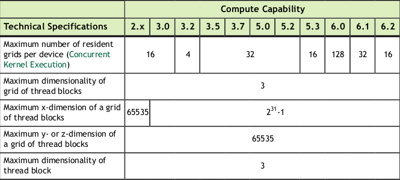

# CUDA PROGRAMMING GUIDE
## 1. INTRODUCTION
### Streaming Multiprocessors
A GPU is built around an array of Streaming Multiprocessors (SMs). A multithreaded program is partitioned into blocks of threads that execute independently from each other, so that a GPU with more multiprocessors will automatically execute the program in less time than a GPU with fewer multiprocessors.


## 2. PROGRAMMING MODEL
### Thread Hierarchy
One can specify synchronization points in the kernel by calling the `__syncthreads()` intrinsic function; `__syncthreads()` acts as a barrier at which all threads in the block must wait before any is allowed to proceed.

### Memory Hierarchy
CUDA threads may access data from multiple memory spaces during their execution as illustrated below. Each thread has private local memory. Each thread block has shared memory visible to all threads of the block and with the same lifetime as the block. All threads have access to the same global memory.


### Compute Capability


#### Feature Support


#### Technical Specifications



## 3. PROGRAMMING INTERFACE
### Device Memory
Device memory can be allocated either as *linear memory* or as *CUDA arrays*. (CUDA arrays are opaque memory layouts optimized for texture fetching.)

Linear memory is typically allocated using `cudaMalloc()` and freed using `cudaFree()` and data transfer between host memory and device memory are typically done using `cudaMemcpy()`.

Linear memory can also be allocated through `cudaMallocPitch()` and `cudaMalloc3D()`. These functions are recommended for allocations of 2D or 3D arrays as it makes sure that the allocation is appropriately padded to meet the alignment requirements, therefore ensuring best performance when accessing the row addresses or performing copies between 2D arrays and other regions of device memory (using the `cudaMemcpy2D()` and `cudaMemcpy3D()` functions).

### Shared Memory
#### Matrix Multiplication Without Shared Memory
``` c
// Matrices are stored in row-major order:
// M(row, col) = *(M.elements + row * M.width + col)
typedef struct 
{
    int width;
    int height;
    float* elements;
} Matrix;

// Thread block size
#define BLOCK_SIZE 16

// Forward declaration of the matrix multiplication kernel
__global__ void MatMulKernel(const Matrix, const Matrix, Matrix);

// Matrix multiplication - Host code
// Matrix dimensions are assumed to be multiples of BLOCK_SIZE
void MatMul(const Matrix A, const Matrix B, Matrix C)
{
    // Load A and B to device memory
    Matrix d_A;
    d_A.width = A.width; d_A.height = A.height;
    size_t size = A.width * A.height * sizeof(float);
    cudaMalloc(&d_A.elements, size);
    cudaMemcpy(d_A.elements, A.elements, size,
    cudaMemcpyHostToDevice);

    Matrix d_B;
    d_B.width = B.width; d_B.height = B.height;
    size = B.width * B.height * sizeof(float);
    cudaMalloc(&d_B.elements, size);
    cudaMemcpy(d_B.elements, B.elements, size,
    cudaMemcpyHostToDevice);

    // Allocate C in device memory
    Matrix d_C;
    d_C.width = C.width; d_C.height = C.height;
    size = C.width * C.height * sizeof(float);
    cudaMalloc(&d_C.elements, size);

    // Invoke kernel
    dim3 dimBlock(BLOCK_SIZE, BLOCK_SIZE);
    dim3 dimGrid(B.width / dimBlock.x, A.height / dimBlock.y);
    MatMulKernel<<<dimGrid, dimBlock>>>(d_A, d_B, d_C);

    // Read C from device memory
    cudaMemcpy(C.elements, Cd.elements, size,
    cudaMemcpyDeviceToHost);

    // Free device memory
    cudaFree(d_A.elements);
    cudaFree(d_B.elements);
    cudaFree(d_C.elements);
}

// Matrix multiplication kernel called by MatMul()
__global__ void MatMulKernel(Matrix A, Matrix B, Matrix C)
{
    // Each thread computes one element of C by accumulating results into Cvalue
    float Cvalue = 0;
    int row = blockIdx.y * blockDim.y + threadIdx.y;
    int col = blockIdx.x * blockDim.x + threadIdx.x;

    for (int e = 0; e < A.width; ++e)
    {
        Cvalue += A.elements[row * A.width + e] * B.elements[e * B.width + col];
    }
    C.elements[row * C.width + col] = Cvalue;
}
```


#### Matrix Multiplication With Shared Memory
``` c
// Matrices are stored in row-major order:
// M(row, col) = *(M.elements + row * M.stride + col)
typedef struct 
{
    int width;
    int height;
    int stride;
    float* elements;
} Matrix;

// Get a matrix element
__device__ float GetElement(const Matrix A, int row, int col)
{
    return A.elements[row * A.stride + col];
}

// Set a matrix element
__device__ void SetElement(Matrix A, int row, int col, float value)
{
    A.elements[row * A.stride + col] = value;
}

// Get the BLOCK_SIZExBLOCK_SIZE sub-matrix Asub of A that is
// located col sub-matrices to the right and row sub-matrices down
// from the upper-left corner of A
__device__ Matrix GetSubMatrix(Matrix A, int row, int col)
{
    Matrix Asub;
    Asub.width = BLOCK_SIZE;
    Asub.height = BLOCK_SIZE;
    Asub.stride = A.stride;
    Asub.elements = &A.elements[A.stride * BLOCK_SIZE * row + BLOCK_SIZE * col];
    return Asub;
}

// Thread block size
#define BLOCK_SIZE 16

// Forward declaration of the matrix multiplication kernel
__global__ void MatMulKernel(const Matrix, const Matrix, Matrix);

// Matrix multiplication - Host code
// Matrix dimensions are assumed to be multiples of BLOCK_SIZE
void MatMul(const Matrix A, const Matrix B, Matrix C)
{
    // Load A and B to device memory
    Matrix d_A;
    d_A.width = d_A.stride = A.width; d_A.height = A.height;
    size_t size = A.width * A.height * sizeof(float);
    cudaMalloc(&d_A.elements, size);
    cudaMemcpy(d_A.elements, A.elements, size,
    cudaMemcpyHostToDevice);

    Matrix d_B;
    d_B.width = d_B.stride = B.width; d_B.height = B.height;
    size = B.width * B.height * sizeof(float);
    cudaMalloc(&d_B.elements, size);
    cudaMemcpy(d_B.elements, B.elements, size,
    cudaMemcpyHostToDevice);

    // Allocate C in device memory
    Matrix d_C;
    d_C.width = d_C.stride = C.width; d_C.height = C.height;
    size = C.width * C.height * sizeof(float);
    cudaMalloc(&d_C.elements, size);

    // Invoke kernel
    dim3 dimBlock(BLOCK_SIZE, BLOCK_SIZE);
    dim3 dimGrid(B.width / dimBlock.x, A.height / dimBlock.y);
    MatMulKernel<<<dimGrid, dimBlock>>>(d_A, d_B, d_C);

    // Read C from device memory
    cudaMemcpy(C.elements, d_C.elements, size,
    cudaMemcpyDeviceToHost);

    // Free device memory
    cudaFree(d_A.elements);
    cudaFree(d_B.elements);
    cudaFree(d_C.elements);
}

// Matrix multiplication kernel called by MatMul()
__global__ void MatMulKernel(Matrix A, Matrix B, Matrix C)
{
    // Block row and column
    int blockRow = blockIdx.y;
    int blockCol = blockIdx.x;

    // Each thread block computes one sub-matrix Csub of C
    Matrix Csub = GetSubMatrix(C, blockRow, blockCol);

    // Each thread computes one element of Csub by accumulating results into Cvalue
    float Cvalue = 0;

    // Thread row and column within Csub
    int row = threadIdx.y;
    int col = threadIdx.x;

    // Loop over all the sub-matrices of A and B that are required to compute Csub
    // Multiply each pair of sub-matrices together and accumulate the results
    for (int m = 0; m < (A.width / BLOCK_SIZE); ++m) 
    {
        // Get sub-matrix Asub of A
        Matrix Asub = GetSubMatrix(A, blockRow, m);

        // Get sub-matrix Bsub of B
        Matrix Bsub = GetSubMatrix(B, m, blockCol);

        // Shared memory used to store Asub and Bsub respectively
        __shared__ float As[BLOCK_SIZE][BLOCK_SIZE];
        __shared__ float Bs[BLOCK_SIZE][BLOCK_SIZE];

        // Load Asub and Bsub from device memory to shared memory
        // Each thread loads one element of each sub-matrix
        As[row][col] = GetElement(Asub, row, col);
        Bs[row][col] = GetElement(Bsub, row, col);

        // Synchronize to make sure the sub-matrices are loaded before starting the computation
        __syncthreads();

        // Multiply Asub and Bsub together
        for (int e = 0; e < BLOCK_SIZE; ++e)
        {
            Cvalue += As[row][e] * Bs[e][col];
        }

        // Synchronize to make sure that the preceding computation is done 
        // before loading two new sub-matrices of A and B in the next iteration
        __syncthreads();
    }

    // Write Csub to device memory. Each thread writes one element.
    SetElement(Csub, row, col, Cvalue);
}
```


### Page-Locked Host Memory
The runtime provides functions to allow the use of page-locked (pinned) host memory (as opposed to regular pageable host memory allocated by `malloc()`):
* `cudaHostAlloc()` and `cudaFreeHost()` allocate and free page-locked host
memory

* `cudaHostRegister()` page-locks a range of memory allocated by `malloc()` (see reference manual for limitations) 

Using page-locked host memory has several benefits:
* Copies between page-locked host memory and device memory can be performed concurrently with kernel execution for some devices 

* On some devices, page-locked host memory can be mapped into the address space of the device, eliminating the need to copy it to or from device memory

* On systems with a front-side bus, bandwidth between host memory and device memory is higher if host memory is allocated as page-locked and even higher if in addition it is allocated as *write-combining*

Page-locked host memory is a scarce resource however, so allocations in page-locked memory will start failing long before allocations in pageable memory. In addition, by reducing the amount of physical memory available to the operating system for paging, consuming too much page-locked memory reduces overall system performance.


<br>
<br>
<br>
<br>
<br>
<br>
<br>
<br>
<br>
<br>
<br>
<br>
<br>
<br>
<br>
<br>


